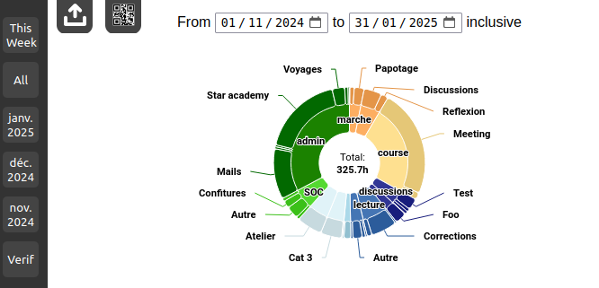
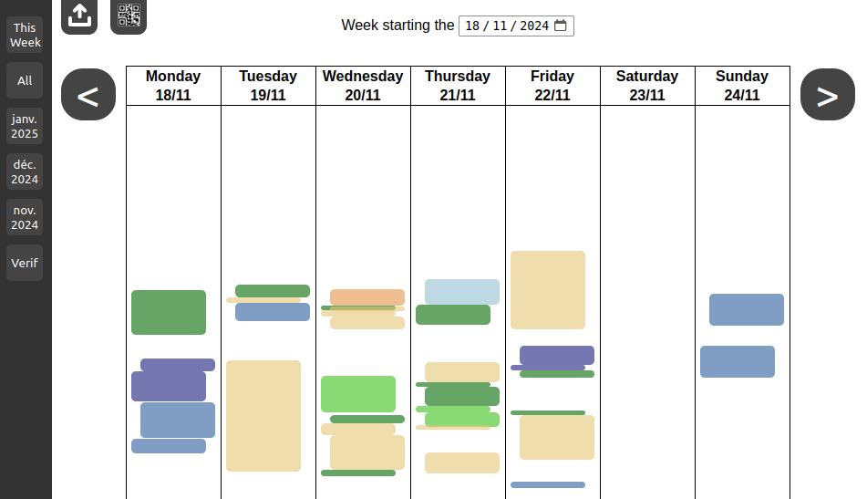

# Time Viewer

This is a small website for viewing time tracking data captured with the [Track&Graph](https://play.google.com/store/apps/details?id=com.samco.trackandgraph&hl=en&pli=1) application.

It displays the data recorded in Track&Graph as a pie chart:

<p align="center">
    
</p>

There is also a Calendar view for verifying that there is no error in the data:

<p align="center">
    
</p>

You can get an idea of what the website looks like [here](https://marcheinrich.fr/testTimeViewer).

## Notes

This is very specific to my use case, so chances are this is not really useful for you.
You're probably better off using a proper time-tracking application.
If you still want to use it though, read on.

The website expects that all your trackers in your Track&Graph application are time trackers, and are organized in two levels, with category folders at the root, and then individual trackers inside each folder.

## Usage 

You need to have NodeJs installed.

Clone the repository, then copy the config-template.yaml to config.yaml, and edit its values if you need. There is a test database public/data-test.db that you can copy to public/data.db if you just want to test the website.

Finally run

```bash
npm install # Install dependencies
node main.js # Start the website
```

## Limitations

Since this was developed for personal use, quite a few corners were cut in the process:

- This is meant to be used by a single user, and there is nothing for user management.
- The whole DB is downloaded every time you access the website, which might pose an issue after some time (though with >1 year of data, performance is still okay).
- It is a bit cumbersome to use: you have to export your data from Track&Graph, then upload it to the website before seeing the graph. It would be better to have all this integrated into an android app (and I have no doubt that such an app probably already exists).
- The UI could use (quite a bit of) polishing, but it's working so not a priority.

## Tech stack

NodeJs, sql.js, and vanilla HTML/CSS.